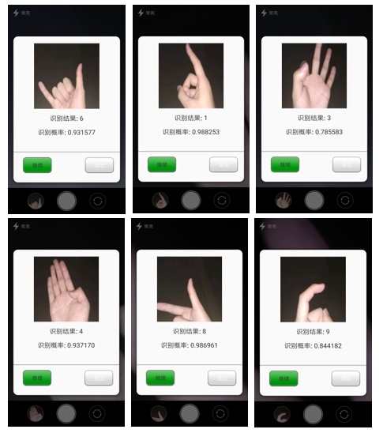
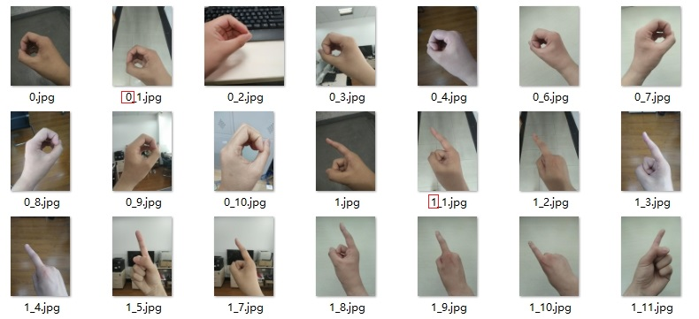

[中文](https://github.com/tz28/Chinese-number-gestures-recognition/blob/master/README.md) &#124; English

# Chinese-number-gestures-recognition
Chinese number gestures recognition app（Android），which can recognize number 0 to 10.

# Chinese number gestures recognition app（Android）based on convolution neural network（CNN）

## 1、Introduction

This is a number gestures recognition app（Android）based on CNN, which can recognize the gestures that captured by mobile camera corresponding to the numbers 0,1,2,3,4,5,6,7,8,9,10.

This project contains two parts: part one is Android APP code which corresponds to DigitalGestureRecognition directory and part two is data preprocessing and training model code which correspond to digital_gesture_recognition directionary, this part wrritted by Python。

development environment：

preprocess data and train model：python3.6, TensorFlow-gpu1.8, keras2.1.6, PIL，NVIDIA GTX1070, 16GB momery

APP：Android studio3.1.2, TensorFlow Lite, opencv-3.4.0-android-sdk

## 2、APP recognition result

### 2.1、daytime environment


### 2.2、nighttime environment


### 2.3、complex environment（in this environment, the accuracy of recognition is low and i'm just curious to try it.)


## 3、Dataset
### 3.1、original data

url：https://pan.baidu.com/s/1whTtvo6GjIFbfKTYXzTZgQ 

The original data consists of 215 digital gestures pictures and those pictures were taken by my friends， thanks so much for their support. The corresponding label of each picture have been tagged in the name of the picture. 
The name of the picture is: label_ identifier. For example:



  ***NOTE: the collected dataset is very small, so, if you want to make a little contribution to the project,
you can put the photos you taken into the collect_picture directionary and naming rules refer to the above naming 
i.e. "label_identifier", identifier can be any number string.***

### 3.2 dataset after data augmentation

url：https://pan.baidu.com/s/1_tLq_HcSmI1kg7VY9pnG5g
There are 21592 pictures in this dataset. This dataset is generated by translation, stretching, rotation and so on and each original photo generate 100 new pcitures. 
The code used to generate these pictures is digital_gesture_recognition/data_augmentation.py. 

**NOTE:** the size of this dataset is 11.6GB, after compression, about 11GB. If you don't want to download it, you can use original dataset and digital_gesture_recognition/data_augmentation.py
 to generate this dataset.

### 3.3、dataset after resize pictures

Each picture was resized to 64*64 pixels, this dataset consists 21592 pictures and  is under the digital_gesture_recognition/resized_img directionary,
the used resize algorithm is **area interpolation** in TensorFlow. the dataset is under digital_gesture_recognition/resized_img_split directionary is the same as resized_img and 
it's just divided into 10 small folders.

### 3.4、H5 dataset

url：https://pan.baidu.com/s/1COV1UVM37X7jueg3wGfXWw

This H5 dataset is converted from the pictures in "resized_img" to the H5 file. The size of this h5 dataset is: 21592*64*64. you can use **h5py** library
to process this dataset. For example, you can use the following code to load the dataset:

```python
data = h5py.File("dataset//data.h5","r")
X_data = np.array(data['X']) #data['X']是h5py._hl.dataset.Dataset类型，转化为array
Y_data = np.array(data['Y'])
```
## 4、The trained model

The model in digital_gesture_recognition/model_200 directionary was trained that the epoch is 200 and model_2500 was trained that the epoch is 2500.
The train accuracy is 99.8% and the test accuracy is 99.5%. However, on the APP, the accuracy is far from that because the environment is more complex.
At the end of PC, a few photos were taken by friends were tested,(those photoes never appeared in training set and test set). The test results were satisfactory. 
The test results were as follows:


## 5、Environment configuration in Android Studio

Transferring the trained model to Android Studio. you can see my blog: https://blog.csdn.net/u012328159/article/details/81101074

Configuring the OpenCV environment in Android Studio, you can see my blog：https://blog.csdn.net/u012328159/article/details/81094436

For other introductions of this project, please see my blog: https://blog.csdn.net/u012328159/article/details/81123018

Note：The camera part of APP uses the CHNicelee code, the url is: https://github.com/CHNicelee/CameraDemo. Thank you.

